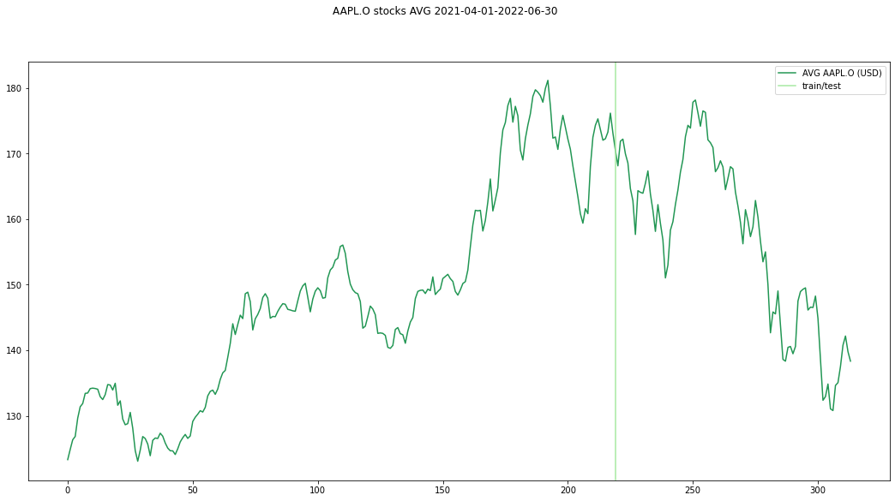

#### Davide Modolo - final 'AI for Finance' project

## Is AI suitable for forecasting stock prices?

### Introduction

The first thing that comes to my mind when I hear 'Artificial Intelligence' and 'Finance' in the same sentence, is the idea of <u>forecasting stock prices using AI (as deep learning algorithms)</u>. I wanted to try it myself to predict the **following day average price**.

I decided to use Ordinary Least Squares as baseline econometric method and I built a Neural Network from scratch that could get comparable result in relation to the ones OLS was giving and study their difference.

I also wanted to include some *Sentiment Analysis* value in the forecasting, using a pretrained Natural Language Understanding model.

---

### Forecasting Models

#### Ordinary Least Squares

I used the `statsmodels API` implementation of OLS, a common technique to estimate coefficients of a linear regression equation with one or more explanatory variables `x` and one independent variable `y`. It's a mathematic method that, with the same implementation, from the same data gives the same result every time (contrarily to neural networks that have some random/stochastic factor in the training phase).

#### Neural Network

Using `Tensorflow` and `Keras` I built a Recurrent Neural Network using four *LSTM* (Long Short-Term Memory) layers that can keep a buffer of past information to make a prediction; since we are talking about time series, it happened to be the right use-case.

I tried dozens of architectures, adding and removing *Dense* or *Dropout* layers, but with the final architecture(the picture on the right) I got quite good results.

And even with this, results vary much depending on the stock analyzed. I also tried pre-built models but I wasn't getting any valuable improvement so I decided to stick to my version.

### Data

Data taken from Refinitiv Eikon APIs database with Python.

#### Data retrieval

Due to APIs limitations, the maximum number of news headlines per request is $100$.

Since I wanted to get news headlines for each of the $n$ day in order to perform a **Sentiment Analysis** task, I had to make $n$ different requests. Regarding numerical data, fortunately it was possible to make one request for the entire time period.

Regarding the time period, I've been forced to use only the last fifteen months since Eikon APIs didn't allow me to get news headlines before 1st April 2021. This could bring up problems like overfitting, but I'll discuss this in the conclusion part.

#### Data cleaning

First of all, explanatory variables for the regression are: open price, close price, highest price, lowest price, volume, count and sentiment value. I computed the average price doing $(\text{OPEN}+\text{CLOSE})/2$ and I shifted it by one day getting the dependent variable. My goal was to predict the **following day average price**.

Then, using the news headlines provided by the APIs, I run the **SentimentIntensityAnalyzer** model given by the `NLTK` library. It returns four values: `[negative, neutral, positive, compound]` as percentages, and I used a modified $\text{sign}$ function (with a threshold) to get the overall sentiment from every day:
$$
\text{sign}(x) =
\begin{cases}
0 && \text{if } -t\le x\ge t\\
1 && \text{if } x > t\\
-1 && \text{if } x < -t\\
\end{cases}
\quad \text{given a positive small number }t
$$
And the entire Sentiment Analysis function, that gives the *sentiment* value for a day $n$ given a set of titles of that day $\text{titles}_{\text{day}_n}$, becomes:
$$
\text{sentiment}_{\text{day}_n}=\sum^{\text{titles}_{\text{day}_n}} \text{sign}(\text{compound}(\text{title}))
$$
The ending list of independent variables is: open, close, high, low, volume, count, sentiment.

Talking about missing data (for example when market are closed or in any other case that data was not available), I decided to not fill the gaps since Machine Learning is highly sensitive to bad quality input data, and synthetic data is obviously not perfect, and I kept the same dataset for OLS to be able to fairly compare results.

For the training part of my NN, I scaled the data between $0$ and $1$, and regarding OLS that needs stationary data, I tried scaling the data also for that. I was getting almost the same parameters values (the only noticeable difference was in the constant value), but it would bring some problems in the code. Results in the **Econometric Analysis** paragraph are result of scaled data, but in the *appendix* code, data will be unscaled for OLS.

Predictions are then *shifted* in order to better compare them with real values.

### Analysis

I'll use as example Apple and Amazon stocks as they have similar $\text{R-squared}$ values and a 5-years $\text{beta}$ similar too ($1.21$ and $1.25$) (and more can be found in the *appendix*).

First this we can see is that, even if they are quite unstable, we can clearly notice that Apple has more 'seasonality', where Amazon unfortunately has almost a different trend between the part I encoded as train and the part I encoded as test. Maybe addressable changing the memory size of *LSTM* layers but I wasn't able to get important differences in my tries.

    

#### Econometric Analysis

 

If we look at each $\text{P-value}$ and we consider $< 0.05$ as statistically significant threshold, we can see that:

- it depends on the stock; for Apple, its statistically significant results are: `[low, close, count]` (and `open` it's almost there) and for Amazon we got `[low, open, close]`;
- it depends on scaling of data; without scaling (as we can see in the *appendix*) results change, giving more significance to sentiment and removing volume and count due to the fact that are really huge numbers compared to the other explanatory variables.

But we can say that, at least for these two firms, the `close` value is very important for the following day average, maybe because the starting value of the following day starts from the closing of the previous day (and then all 'buffered' orders are completed).

Talking about the Sentiment Analysis factor, we can see that even with two 'big and discussed' companies, there is a huge difference in their *P-values*, and even more in the appended code.

Given this, I think that we cannot write a general 'rule' that comprehends every stock, but overall we can see in the plots in the *Neural Network Analysis* paragraph (and in the *appendix*) that OLS doesn't perform well with quick spikes.

Mean Squared Error of OLS for Apple is $2.709$ and for Amazon is $18.039$.

#### Neural Network Analysis

I split the data in train and test with 70%/30%; it's the usual splitting strategy and also the one that gave me better results. Scaled data was also needed to perform the training of the neural network, otherwise units of the layers could get some problems in the process.

The training step is repeated for $40$ epochs, hyperparameter chosen on various different runs (with a batch size of $32$). Regarding the *LSTM* memory lag, I sticked to the value $1$ since I was able to get so few samples and I wanted to have the maximum possible amount of data to train and test. 

The first thing that catches the eye is that in the Amazon plot, the NN result is extremely wrong after half of the values; this could be due to some problems I will discuss in the *Conclusion* paragraph (overfitting).

It's also important to underline the limited availability of data. With more available data, the network could have been able to better learn some rare behaviors. But it also depends on the architecture of the network, and in my case, I came to the final architecture because I tried to get interesting results with also the inclusion of the sentiment analysis part.

Mean Squared Error of NN for Apple is $0.256$ and for Amazon is $346.394$;
for Apple NN is one order of magnitude better, for Amazon is one order of magnitude worse than OLS.

### Conclusion

| Stock | Market Cap | Beta | R-squared | NN MSE  | OLS MSE |
| ----- | ---------- | ---- | --------- | ------- | ------- |
| AAPL  | 2.38T      | 1.21 | 0.991     | 0.256   | 2.709   |
| AMZN  | 1.18T      | 1.25 | 0.932     | 346.394 | 18.039  |
| MSFT  | 2T         | 0.93 | 0.991     | 5.331   | 5.747   |
| KO    | 273B       | 0.58 | 0.979     | 0.024   | 0.149   |

I wanted to include two more stocks in the last paragraph (and in the appended code even more can be found). The difference between *NN* MSE and *OLS* MSE values highly depends on the stock, but we can see that on average, the NN has a lower error. From the table, we can also deduce that probably the error is not related to *Market Capitalization*, *beta* value or *R-squared* value.

With some stocks my code works pretty fine, but with other it is totally wrong.

This could be due to an *overfitting* problem or to the number of available training samples: since in the training we are not able to have a general representation of all possible behaviors, the NN is not able to understand them and neither to predict them. This is clearly visible in the Amazon stock plot where the training part is quite stable but in the test we immediately have a big drop in average price: the NN predictions continue the past trend. This could be a clue that, since market movements could be unpredictable, there could always be an unexpected behavior that breaks our strategy.

Also, the network didn't learned general parameters, but it has been trained from scratch for each stock.

So, after seeing that I could not get consistent results, is this work useless? In my opinion it's not. First of all, thanks to this project and this course I was able to learn from zero concepts of the entire economic field, better understanding terms and methodologies used, and I think this project helped me merge this new world with what I'm mainly studying.

And secondly, the model could be improved (in the architecture, parameters, hyperparameters, available data and so on) to create an indicator or metric that, if there isn't something unusual 'in the air', would create some reliable forecasts to use as baseline for some choices and strategies.

# Appendix: Python Notebook with code and more stocks results

